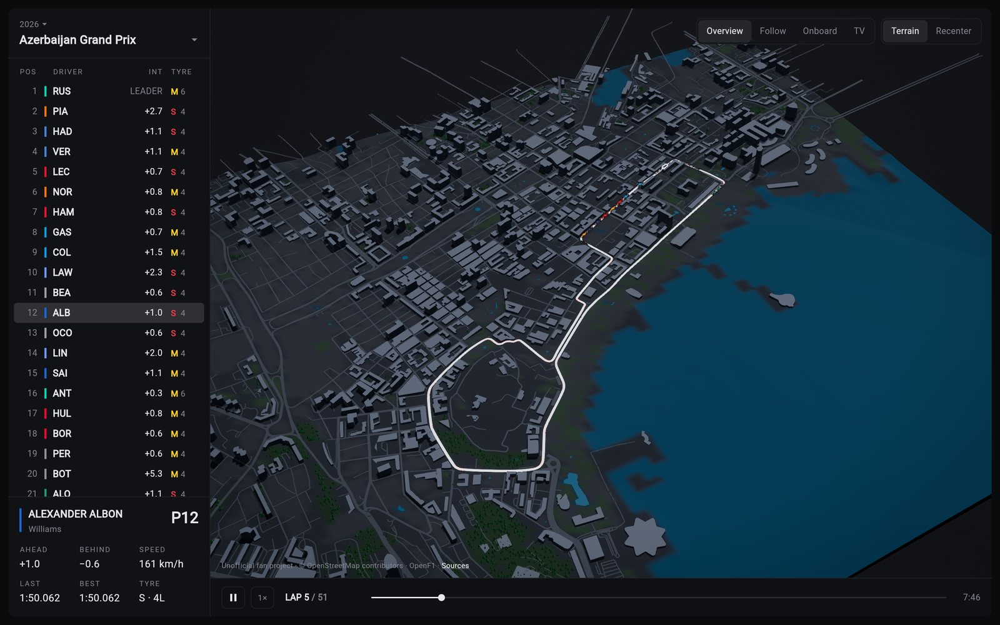
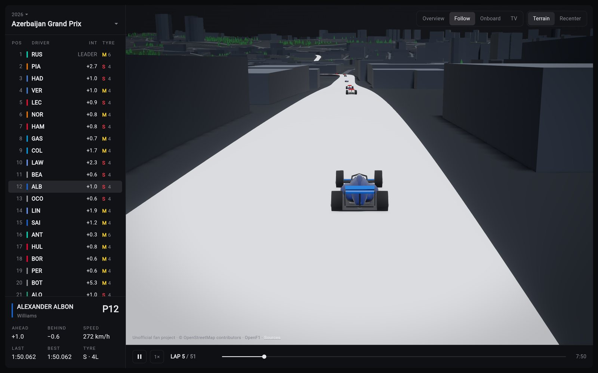
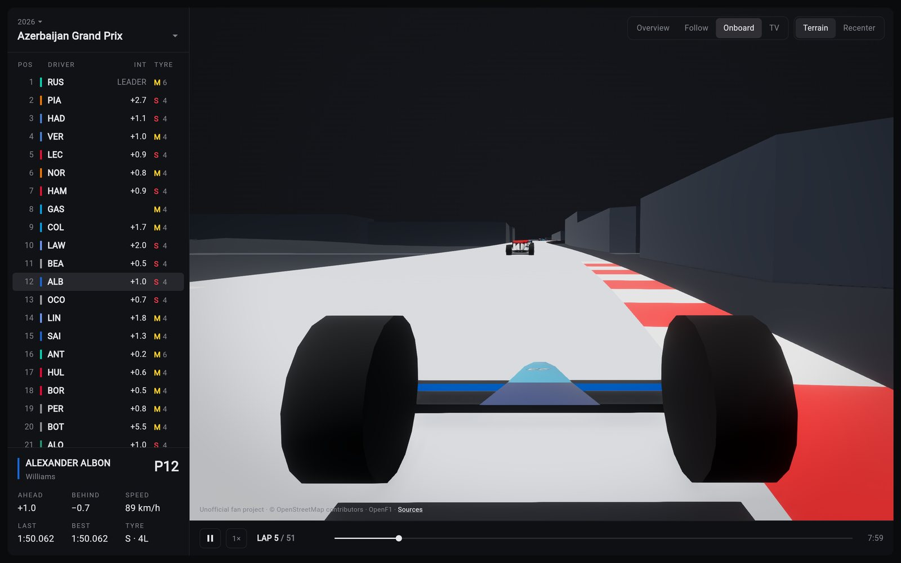
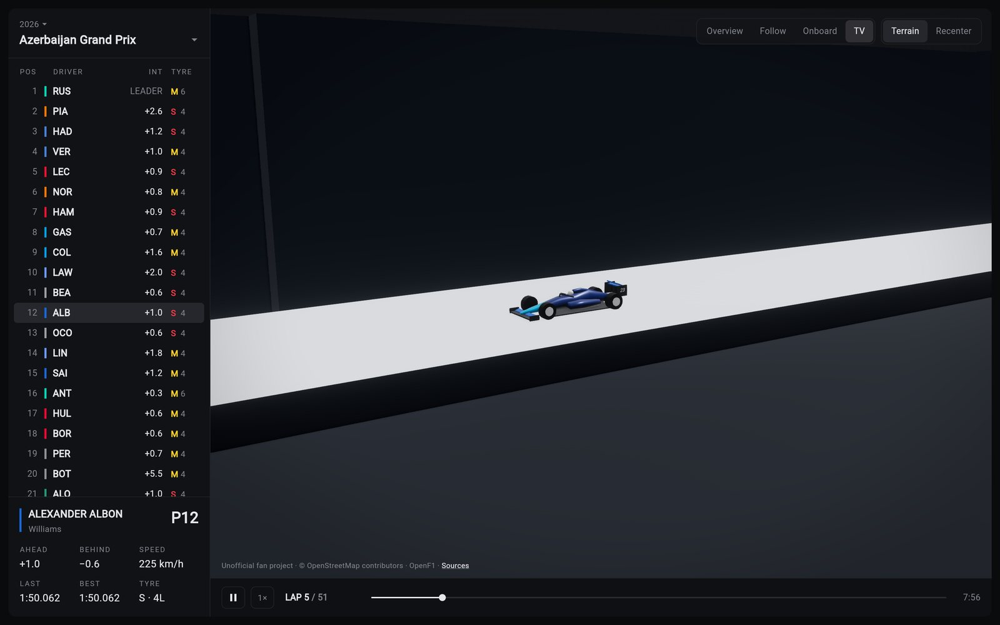
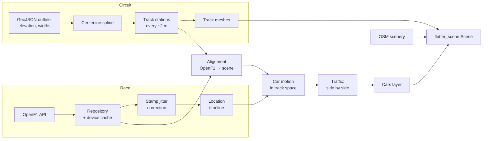

# f1_scene

[](https://github.com/aumb/f1_scene/actions/workflows/ci.yml)

Formula 1 races from 2023 on, replayed on 3D dioramas of their circuits.
Built in Flutter with [flutter_scene](https://pub.dev/packages/flutter_scene),
Flutter's 3D renderer.

**[Open the live demo](https://aumb.github.io/f1_scene/)**. It runs in any
recent desktop browser, best in one with WebAssembly GC (Chrome or Edge 119+,
Firefox 120+, Safari 18.2+).



| Follow | Onboard | TV |
| --- | --- | --- |
|  |  |  |

f1_scene began as a way to learn flutter_scene on something with real data
and real constraints. It is open source so that others can learn from it
too. Everything from a GeoJSON outline to the pixels on screen is plain Dart
you can read: the meshes, the maths that smooths positions arriving four
times a second, the cameras. This README explains how the pieces fit, and
links to the code that does each part.

> Unofficial fan project, not affiliated with Formula 1. See [NOTICE.md](NOTICE.md).

**Contents:** [Features](#features) ·
[Running it](#running-it) · [Controls](#controls) ·
[How it works](#how-it-works) · [flutter_scene features used](#flutter_scene-features-used) ·
[Lessons learned](#lessons-learned) · [Project map](#project-map) ·
[Tools](#tools) · [Tests](#tests) · [Limitations](#limitations) ·
[Contributing](#contributing) · [Data and licences](#data-and-licences)

## Features

- **Every race from 2023 on** at the 31 circuits included, picked by season
  and Grand Prix. All the cars are driven from
  [OpenF1](https://openf1.org)'s position data. You can play, pause, scrub,
  and watch at 1×, 4×, 16× or 64×.
- **Circuits as dioramas.** Each circuit has its real width and elevation,
  kerbs, start/finish and sector lines, DRS zones, and a pit lane traced
  from a real pit stop. Around it are the terrain, buildings, roads, water
  and woods from OpenStreetMap.
- **Four cameras:**
  - **Overview** works like a map.
  - **Follow** chases a car.
  - **Onboard** rides on its airbox.
  - **TV** cuts between trackside posts placed where buildings don't block
    the view.
- **Timing.** A tower shows position, interval or gap, tyre and tyre age. A
  card for the followed driver shows the gaps ahead and behind, speed, last
  and best lap, and tyre.
- **Cars** are a low-poly model built in code. Each is painted in its team's
  colours and carries its number. There is no sponsor artwork, because
  that is trademarked.
- **Web first** (WebAssembly), and it also runs on macOS, iOS and Android.

## Running it

You need Flutter 3.47 or newer (stable).

```sh
flutter pub get
flutter run -d chrome --release --wasm   # the web, the main target
flutter run -d macos --release           # or ios, android
```

Judge performance in `--release`: debug builds are many times slower.
`--wasm` compiles to WebAssembly, which ran about 8% faster frames than
JavaScript here. Browsers without WasmGC load the JavaScript build that
ships alongside it. Native builds turn on Flutter GPU, which flutter_scene
needs, in the platform files (`FLTEnableFlutterGPU` in the Info.plists,
`EnableFlutterGPU` in the Android manifest).

No API keys are needed. Race data comes straight from OpenF1's free tier,
and scenery from a pinned commit of
[F1TrackViewer](https://github.com/Makakashan/F1TrackViewer).

## Controls

The Overview camera behaves like a map: the ground follows the pointer, and
zooming heads for whatever is under the cursor.

| | Rotate | Pan | Zoom |
| --- | --- | --- | --- |
| Mouse | left drag | right or middle drag, or shift + drag | wheel |
| Trackpad | click + drag (two-finger twist in desktop builds) | two-finger swipe | pinch |
| Touch | one finger | two fingers | pinch |

In Follow and Onboard, dragging looks around the car. Click a driver in the
tower to follow them. **Recenter** returns the active camera to its default
view.

Two URL options help when measuring:

- `?stats` (or the **F** key) shows frame rate, frame times and render scale.
- `?scale=0.75` fixes the render resolution, which otherwise adapts (see
  [Performance](#performance)).

## How it works



### Circuits: from a GeoJSON outline to meshes

The circuit data is vendored under [`assets/circuits/`](assets/circuits). It
comprises:

- centerlines from bacinger/f1-circuits
- elevation, start/finish and sector markers from F1TrackViewer
- measured widths from TUM's racetrack database

1. **Projection.** [`LocalProjection`](lib/src/geometry/geo.dart) turns
   longitude and latitude into meters around the circuit, using the WGS84
   ellipsoid's radii there. **flutter_scene's world is left-handed**: seen
   from above, +X lies to the right of +Z. So north is +Z and east is +X,
   and the circuit draws as it does on a map. With north at −Z, every
   circuit came out mirrored (see [Lessons learned](#lessons-learned)).
2. **Centerline.** [`Centerline`](lib/src/geometry/centerline.dart) is a
   closed centripetal Catmull-Rom spline through the outline. Positions on
   it are given by `s`, the fraction of the lap from its first point. Width
   samples and sector splits are addressed the same way.
3. **Stations.** [`TrackStations`](lib/src/geometry/track_mesh.dart) samples
   the spline every ~2 m. Each station records its center, its forward and
   left directions, and its distance to each edge. The source outlines are
   coarse and tighten a few hairpins too much, so the inside edge of a
   corner tighter than the track's half-width is pulled in to keep the
   surface from folding over itself.
4. **Meshes.** [`TrackMeshBuilder`](lib/src/geometry/track_mesh.dart) builds:
   - the surface, and skirts down to the base
   - kerbs, placed from curvature: inside every corner, and outside the exit
     of tight ones
   - the start/finish and sector lines
   - the DRS bands

   Everything goes through one
   [`MeshBuilder`](lib/src/geometry/mesh_arrays.dart). It winds each
   triangle to face a given direction, so no index order has to be right by
   hand. It produces plain arrays, which [`uploadMesh`](lib/src/scene/mesh_upload.dart)
   hands to flutter_scene. Nothing in `geometry/` imports Flutter, so all of
   it is unit tested.
5. **Projector.** [`TrackProjector`](lib/src/geometry/track_projector.dart)
   converts between scene positions and *(along, lateral)*: stations along
   the lap, and meters left of the centerline. Given a hint, it stays on the
   car's own stretch of track where the circuit passes close to itself.

### Race data: OpenF1, cached

- [`OpenF1Client`](lib/src/race/openf1_client.dart) sends every request
  through a sliding-window limiter for OpenF1's free tier: 3 a second and 30
  a minute, per visitor's address. It retries 429s with backoff, and asks
  only once when the same request is made twice at the same time.
- [`RaceRepository`](lib/src/race/race_repository.dart) parses responses
  into [models](lib/src/race/race_models.dart). It also decides how long
  each may be kept in [`DataCache`](lib/src/data/data_cache.dart), which has
  two layers:
  - **Memory.** A least-recently-used cache.
  - **The device.** Cache Storage in the browser, or a temporary directory
    elsewhere. Only data that can no longer change goes here: races that
    ended more than a day ago, and past seasons' calendars. Reloading a race
    then costs no requests.
- Car positions (`location`, about 3.85 samples per second per car) are
  stored as a compact binary
  [`LocationBatch`](lib/src/race/location_batch.dart). Five minutes take
  about 220 KB this way, against about 3 MB of JSON.
- [`RaceReplay.load`](lib/src/race/race_replay.dart) fetches the race's
  drivers, laps, pit stops, positions, intervals and stints in parallel.
  During playback, [`LocationTimeline`](lib/src/race/location_timeline.dart)
  streams positions in 5-minute chunks around the playhead, two chunks ahead
  at 16× and above. Playback waits while a chunk loads.

### Aligning OpenF1 onto the circuit

OpenF1 reports positions in its own frame. It is in decimetres, with x east
and y north to within a couple of degrees, around an arbitrary origin.
[`alignToLap`](lib/src/race/session_alignment.dart) takes one clean lap of
one car. [`alignToPath`](lib/src/geometry/track_alignment.dart) then fits a
similarity transform (scale, rotation, translation) from that lap onto the
centerline: an iterative closest point fit that drops the worst 10% of
matches. The result lands within 1.7–3.9 m RMS on every 2024 venue (run
`dart run tool/check_alignment.dart 2024`).

### Making the cars move smoothly

Two things in the raw data would make cars stutter, and one more would make
them drive through each other:

1. **Shared, jittery timestamps.** OpenF1 stamps each batch of positions
   (one sample per car) with when it *arrived*, not when it was measured.
   That is up to ~0.1 s off (26 ms typical at Baku in 2024). Followed literally, a
   car at a steady 200 km/h swings between 150 and 350. Every car in a batch
   shares the error, though, and that makes it measurable: a car further
   along than its own smooth motion predicts was really sampled later.
   [`correctStampJitter`](lib/src/race/stamp_jitter.dart) moves each stamp
   by the median of that estimate over the cars at speed.
2. **Samples ~20 m apart.** [`CarMotion`](lib/src/race/car_motion.dart)
   converts every sample to track space (along, lateral), either on the
   circuit or in the pit lane. It then fits the motion around the playhead
   with a kernel-weighted local quadratic ([`LocalFit`](lib/src/race/local_fit.dart))
   over ±1.3 s. Cars follow corners instead of cutting the chords between
   samples, hold a steady speed, stay inside the track edges despite the
   alignment error, and turn their nose into a lane change.
3. **One shared line.** OpenF1 puts every car on a single line around the
   lap: cars at the same spot differ by ~4 cm sideways. So the data never
   says who is beside whom. [`TrafficSeparation`](lib/src/race/traffic.dart)
   synthesises side-by-side racing. Each pair of nearby cars is a spring that
   grows from nothing as they close in, sooner the faster they close. The
   lower car number always takes the left, so no car passes through
   another. In the Overview, where cars are drawn enlarged so they stay
   visible, `readableScales` shrinks each car toward real size as another
   comes near, so a battle never merges into one blob.

`dart run tool/check_motion.dart` measures all three; see [Tools](#tools).

### Scenery

[`EnvironmentRepository`](lib/src/data/environment_repository.dart) fetches
F1TrackViewer's generated environments at runtime: the terrain grid,
buildings, roads, water and land use derived from OpenStreetMap. At about
70 MB in total, they are too large to vendor.
[`EnvironmentMeshBuilder`](lib/src/geometry/environment_mesh.dart) then:

- upsamples the terrain and shapes it to the track: cut down where it would
  rise through the surface, built up where it falls away, and eased back to
  the real ground further out
- extrudes the buildings, leaving out any that touch the track
- drapes the roads, breaking them where they would cross the circuit
- sinks the water to its shore and scatters trees through the woods

The **Terrain** toggle swaps all of it for a plain slab.

### Rendering

- [`TrackScene`](lib/src/scene/track_scene.dart) owns the flutter_scene
  `Scene`:
  - a directional light whose shadow map is cached for everything that never
    moves
  - ACES tone mapping, bloom, ground-truth ambient occlusion, colour grading
    and a vignette
  - the diorama, and during a replay, the cars, pit lane and DRS zones

  The materials are in [`DioramaMaterials`](lib/src/scene/diorama_materials.dart).
  Colours come from vertices, and surfaces lying flush on one another settle
  the depth tie with `depthLayer`.
- [`CarsLayer`](lib/src/scene/cars_layer.dart) shares one car geometry
  ([`CarMeshes`](lib/src/geometry/car_mesh.dart)) among all the cars:
  - each car's bodywork is painted per vertex in its
    [livery](lib/src/race/liveries.dart), so it draws in one call
  - each car's number is drawn with a `TextPainter` into a texture
  - the followed car is outlined in the Overview
- [`CameraRig`](lib/src/scene/camera_rig.dart) holds the camera and the
  controller that drives it, and routes gestures to whichever is active:
  - [`MapCameraController`](lib/src/scene/map_camera.dart) is the Overview
  - the [Follow, Onboard and TV controllers](lib/src/scene/race_cameras.dart)
    film the followed car

  TV posts are tried at several distances and heights. Each post stands
  where sight lines to the approach it films clear the buildings and
  terrain, and the camera cuts only to posts that can see the car.

### Performance

The scene's cost is mostly per pixel, so on a large or high-density screen
it is fill-bound. A 1920×1080 window on a 2× display held ~72 fps at full
resolution. [`AdaptiveResolution`](lib/src/scene/adaptive_resolution.dart),
driven by [`FramePacer`](lib/src/ui/frame_pacer.dart), starts within a
pixel budget for the window. It then lowers `Scene.renderScale` quickly
while frames miss the display's refresh, and raises it again slowly once
they stop. On that screen it holds ~112 fps at about 0.74 scale.
flutter_scene's built-in adaptive quality never recovered at 120 Hz, hence a
controller of our own.

Work that runs when a chunk of positions arrives runs on the thread that
draws frames. It uses flat typed arrays and lets a frame through between
passes (`yieldToFrames`), so loading never freezes playback.

## flutter_scene features used

| Feature | Where |
| --- | --- |
| `Scene`, `Node`, `SceneView` (`onTick`, `warmUp`) | [track_scene.dart](lib/src/scene/track_scene.dart), [track_screen.dart](lib/src/ui/track_screen.dart) |
| `MeshGeometry.fromArrays`, updatable storage | [mesh_upload.dart](lib/src/scene/mesh_upload.dart): the track's skirts reach down to scenery that loads later |
| `Mesh.primitives`, `PhysicallyBasedMaterial`: vertex colours, `depthLayer`, alpha blending | [diorama_materials.dart](lib/src/scene/diorama_materials.dart), [cars_layer.dart](lib/src/scene/cars_layer.dart) |
| `Texture2D.fromImage` | [cars_layer.dart](lib/src/scene/cars_layer.dart): car numbers |
| `InstancedMesh` with per-instance colour and culling | [track_scene.dart](lib/src/scene/track_scene.dart): thousands of trees |
| `CuboidGeometry`, `CylinderGeometry` | [track_scene.dart](lib/src/scene/track_scene.dart): the slab, trees |
| `DirectionalLight` shadows, `shadowStatic`, `ShadowCastingMode` | [track_scene.dart](lib/src/scene/track_scene.dart), [mesh_upload.dart](lib/src/scene/mesh_upload.dart) |
| `EnvironmentSettings`: tone mapping, bloom, AO, grading, vignette | [track_scene.dart](lib/src/scene/track_scene.dart) |
| `CameraComponent`, `PerspectiveProjection`, custom `CameraController`s | [camera_rig.dart](lib/src/scene/camera_rig.dart), [map_camera.dart](lib/src/scene/map_camera.dart), [race_cameras.dart](lib/src/scene/race_cameras.dart) |
| `Camera.screenPointToRay` | [map_camera.dart](lib/src/scene/map_camera.dart): dragging the ground, zooming toward the cursor |
| `Node.highlightColor` | [cars_layer.dart](lib/src/scene/cars_layer.dart): outlining the followed car |
| `Scene.renderScale` | [frame_pacer.dart](lib/src/ui/frame_pacer.dart) |
| `Scene.probeDepthConflicts` | [track_screen.dart](lib/src/ui/track_screen.dart): debug builds report z-fighting |

## Lessons learned

Things that cost time to find, and might save you some:

- **flutter_scene's world is left-handed.** Its look-at matrix puts screen
  right at `up × forward`. Put north at −Z, as you might in a right-handed
  engine, and everything, from track to scenery, renders as a mirror image.
  It is consistent with itself, so nothing looks wrong until you compare it
  with a map. For the same reason, a level "left" is `forward × up`, and
  `(b − a) × (c − a)` pointing at the camera means a triangle is clockwise
  on screen. [orientation_test.dart](test/geometry/orientation_test.dart)
  pins these down.
- **vector_math's `Quaternion.rotated` applies the inverse** of the rotation
  `Matrix4.compose` applies. Check orientation in tests through `compose`,
  which is what the renderer uses.
- **Data, not frame rate.** Cars that seemed to stutter were moving to
  timestamps that arrived late, while the frame rate was steady. Measure
  motion and frame timing separately.
- **Windowed searches must not accept a match at the window's edge.** A car
  just past the projector's search window snapped to its edge, up to 12 m
  off, which showed as surges at 300 km/h.
- **Anything per frame, per car, adds up.** One uncapped projection search
  in the pit lane code cost 7 ms a frame. `DateTime.parse` on 100k rows
  cost a 22 ms hitch, which a hand-written parser removed.
- **Under WebAssembly, frame intervals don't snap to the display's
  refresh.** They read ~13 ms rather than 8.3 or 16.7, so frame-timing logic
  must not assume they do.
- **`BrowserContextMenu.disableContextMenu()` needs the bindings first.**
  Call `WidgetsFlutterBinding.ensureInitialized()` before it. The
  WebAssembly build throws without it; the JavaScript build silently does
  nothing.
- **`Future.whenComplete(() => map.remove(key))` can deadlock.** It waits for
  whatever its callback returns, which here is the future itself. Use a
  block body ([openf1_client.dart](lib/src/race/openf1_client.dart)).

## Project map

```
lib/
  main.dart                   app entry: theme and TrackScreen
  src/
    data/                     circuit model, loading, the device cache
      circuit.dart            a circuit in scene space, from its vendored files
      data_cache.dart         memory + device cache, with Keep lifetimes
      environment_repository.dart   scenery fetched from F1TrackViewer
    geometry/                 pure Dart: projection, splines, meshes, fitting
      geo.dart                lon/lat to scene meters (the axes live here)
      centerline.dart         arc-length Catmull-Rom spline
      track_mesh.dart         stations and the track's meshes
      track_projector.dart    scene position <-> (along, lateral)
      track_alignment.dart    ICP fit of OpenF1's frame onto the circuit
      environment_mesh.dart   terrain, buildings, roads, water, trees
      car_mesh.dart           the car, built in code
      mesh_arrays.dart        MeshArrays and MeshBuilder
    race/                     OpenF1 to car poses
      openf1_client.dart      rate-limited, cached HTTP client
      race_repository.dart    parsing and cache lifetimes
      race_replay.dart        one race: data, clock, poses, standings
      stamp_jitter.dart       timestamp correction
      car_motion.dart         track-space motion fitting
      traffic.dart            side-by-side separation
      timing_board.dart       the timing screens at any moment
    scene/                    flutter_scene: the diorama, cars, cameras
      track_scene.dart        the Scene and what is in it
      camera_rig.dart         camera modes and gesture routing
      race_cameras.dart       Follow, Onboard and TV cameras
      adaptive_resolution.dart   render scale vs. frame rate
    ui/                       widgets: screen, rail, controls, gestures
test/                         mirrors lib/; shared fakes and fixtures in support/
tool/                         data vendoring and measurement scripts
assets/circuits/              vendored circuit data (see NOTICE.md)
```

## Tools

Run these from the repository root.

| Command | What it does |
| --- | --- |
| `dart run tool/check_alignment.dart [year]` | Fits OpenF1's frame onto every circuit raced that year, as a replay does, and reports the fit error, rotation and traced pit lane. A large error means the vendored layout differs from the one raced that year. |
| `dart run tool/check_motion.dart [year] [meeting] [--start] [--raw] [--no-traffic]` | Poses five minutes of a race at 60 fps through the app's motion code. It reports how often a car would need more than 6 g (stutter), how often cars wobble, and how often they overlap. `--raw` and `--no-traffic` turn off stamp correction and side-by-side separation, to show what each contributes. |
| `dart run tool/fetch_circuits.dart` | Re-vendors the circuit data from the pinned upstream commits. |

```
$ dart run tool/check_motion.dart 2024 azerbaijan
Azerbaijan Grand Prix 2024: 20 cars
  surge (speed changes): over 6 g 1.2%, median 8.7 p99 65 m/s²
  sway (turning, sideways): over 6 g 2.0%, median 3.0 p99 79 m/s²
  reversals per car-minute: lateral 22.1, heading 15.4, orbit size 12.9; ...
  alongside (within a car length): 294 pair samples, lateral gap median 2.3 m; overlapping 0 (0%)
```

## Tests

```sh
flutter test
```

The suite runs in a few seconds and needs no network: OpenF1 and the device
store are faked ([test/support/fakes.dart](test/support/fakes.dart)). The
geometry tests build the track on all 31 circuits and check that every
triangle faces the right way. The race tests drive synthetic cars through
the motion, traffic and timestamp code, and check the results against what
they were given. CI ([.github/workflows/ci.yml](.github/workflows/ci.yml))
runs the format check, `flutter analyze` and the tests on every push and
pull request. The WebAssembly build runs alongside them.

## Limitations

- **Sideways positions are synthesised.** OpenF1 has none, so who is on
  which side when two cars are alongside is a convention (lower number on
  the left), not what happened.
- **Positions come about four times a second.** Fast changes of direction
  between samples are smoothed over.
- **Liveries are approximate colours**, with no sponsors or artwork.
- **Some 2026 venues are missing.** Madrid and Sepang can't be selected yet:
  their layouts exist upstream, but without start/finish and sector markers.
- **Historic races only.** There is no live timing.
- **Some circuits have changed since their layout was vendored**, and those
  align less tightly. `check_alignment` shows which.

## Contributing

Issues and pull requests are welcome. Before you push:

```sh
dart format lib test tool
flutter analyze
flutter test
```

CI runs the same checks. The code favours small, documented pieces over
cleverness: comments say *why*, constants have names and units, and a piece
of logic lives in one place. Keep to that, and add a test for any behaviour
you change. For anything visual, check it in a `--release` web build with
`?stats` on.

## Data and licences

The code is MIT-licensed ([LICENSE](LICENSE)).

- **Circuit data** is vendored under `assets/circuits/` from pinned commits,
  and keeps its upstream licences: MIT for most, LGPL-3.0 for the track
  widths.
- **Race data** (OpenF1, CC BY-NC-SA 4.0) and **scenery** (© OpenStreetMap
  contributors, ODbL, via F1TrackViewer) are fetched at runtime by each
  visitor and never committed here.

[NOTICE.md](NOTICE.md) lists every source and its licence; the app credits
them behind **Sources**.
